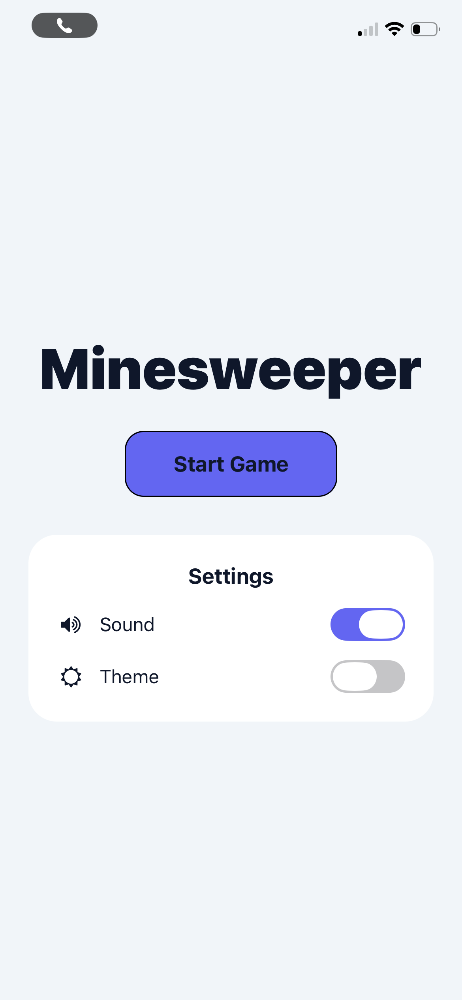
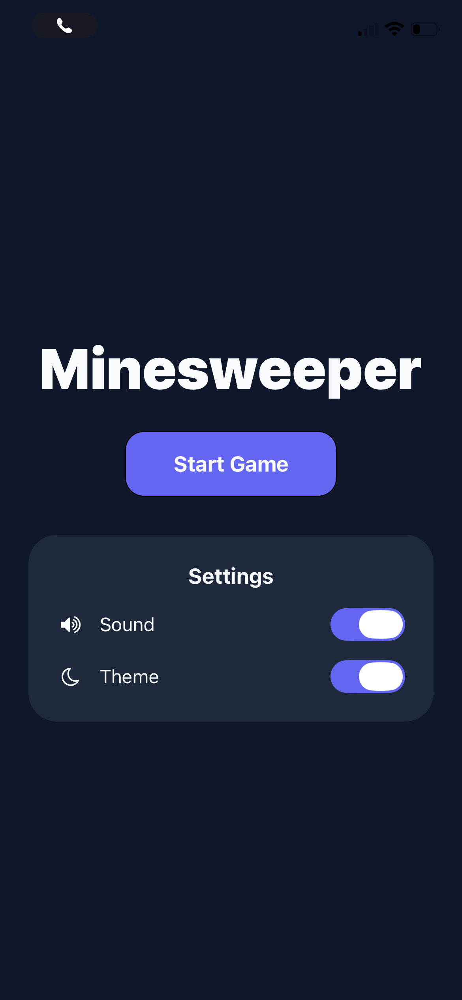
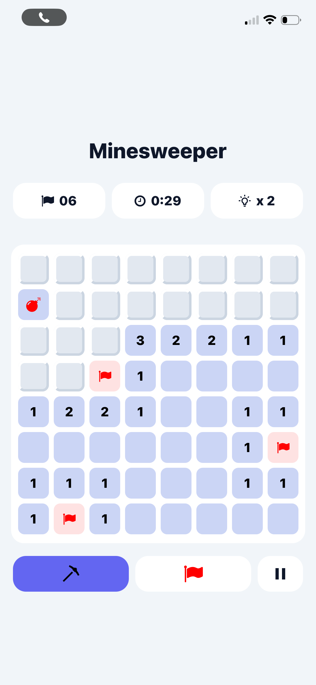
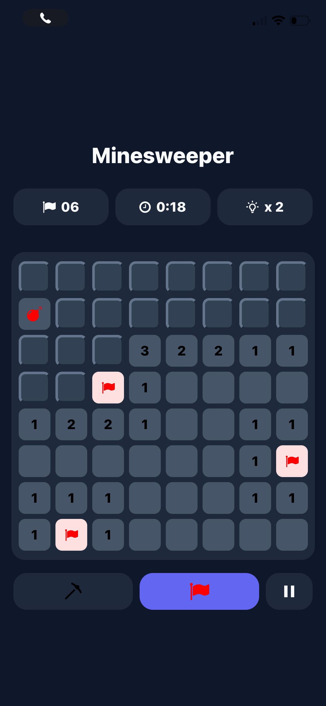
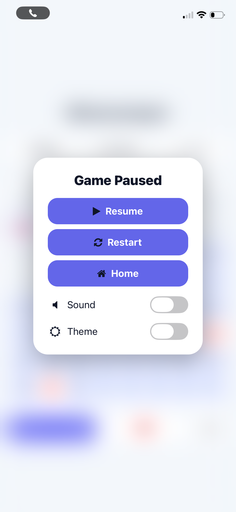
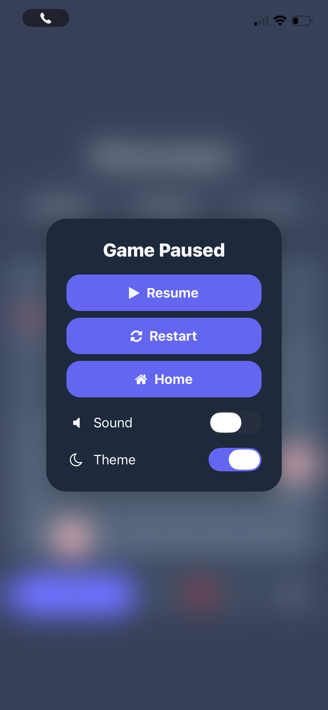
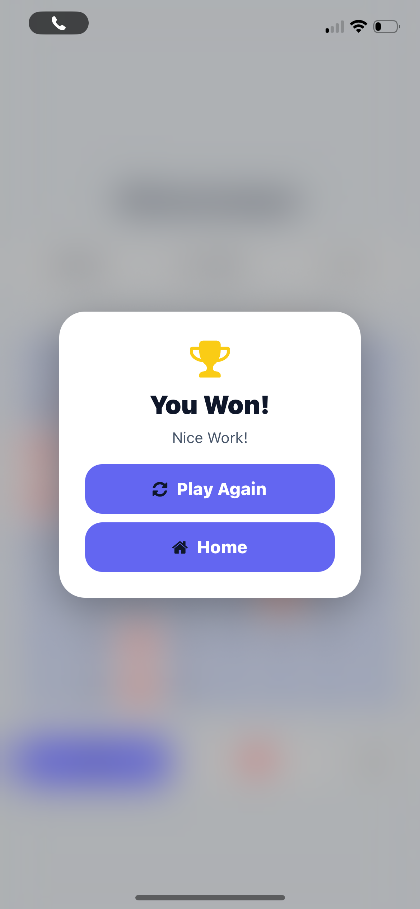
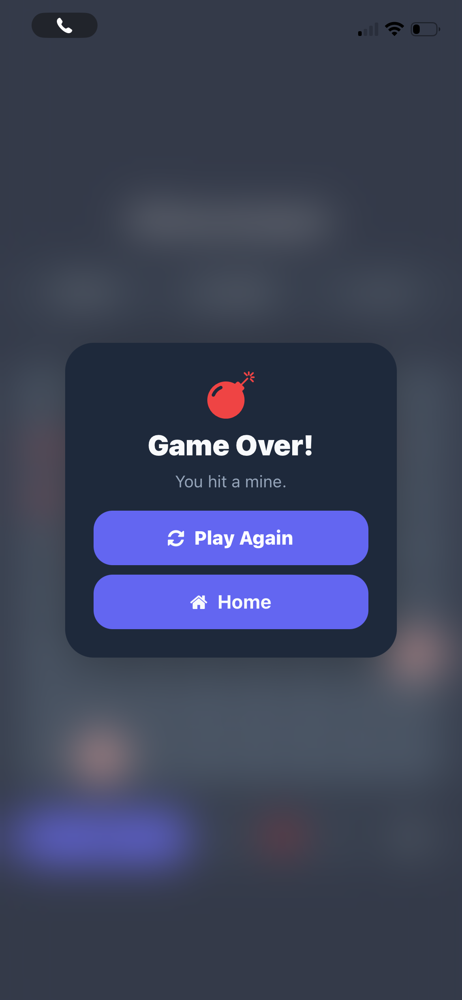

# Minesweeper (React Native + Expo)

Classic Minesweeper mobile game built with **React Native** and **Expo**.  
Runs locally with no backend.

## Features

- Two screens: **Home** and **Game**
- Minesweeper board with **Dig** / **Flag** modes
- Classic mechanics:
  - Numbers (1–8) show adjacent mines
  - Auto-reveal chain for empty cells (0 adjacent mines)
  - Win when all safe cells are revealed
  - Lose on mine reveal
- **Pause** modal & **Result** modal
- **Sound effects** (reveal / bomb / win) with toggle
- **Light / Dark theme** toggle
- Extra UI helpers:
  - Flag counter
  - Timer
  - Hint button (reveals a mine visually without ending the game)

---

## Tech Stack

- Expo
- React Native
- React Navigation (Native Stack)
- expo-blur
- expo-audio
- @expo/vector-icons

---

## Requirements

- Node.js (LTS recommended)
- npm or yarn
- Expo CLI (optional; project can be run with `npx`)

---

## Install & Run

### 1) Install dependencies

```bash
npm install
```

### 2) Start the development server

Run the following command:

```bash
npm start
#OR
npx expo start
```
This command starts the Expo development server and opens the Expo Dev Tools in the browser.

After starting the server, the application can be run in multiple ways:

- Physical device using Expo Go
- iOS Simulator
- Android Emulator
- Web browser

---

## Run on a Physical Device (Expo Go)

1. Install Expo Go on your device:
   - iOS → App Store
   - Android → Google Play Store

2. Make sure your mobile device and computer are connected to the same Wi-Fi network.

3. Start the project:

npx expo start

4. Scan the QR code displayed in the terminal or browser.

- iOS: Use the Camera app to scan the QR code.
- Android: Open the Expo Go app and use the "Scan QR Code" option.

The application will automatically open and run on your device.

---

## Run on iOS Simulator (macOS Only)

Requirements:

- macOS
- Xcode installed

Steps:

1. Start the development server:

npx expo start

2. Press the following key in the terminal:

i

This will launch the app in the iOS Simulator.

Alternatively, you can click "Run on iOS simulator" in the Expo Dev Tools interface.

---

## Run on Android Emulator

Requirements:

- Android Studio
- Android Virtual Device (AVD)

Steps:

1. Open Android Studio.
2. Navigate to Device Manager.
3. Start an Android emulator.
4. Start the development server:

npx expo start

5. Press the following key in the terminal:

a

This will open the application in the Android emulator.

---

## Run in Web Browser

Expo also supports running the application in a browser.

Run:

npx expo start --web

or press:

w

after starting the development server.

Note:  
The primary target platforms are iOS and Android mobile devices. Web support is mainly intended for development convenience.

---

## Project Structure

The project follows a modular structure to keep responsibilities clearly separated.

src/

navigation/
- AppNavigator.tsx – Navigation configuration for the application

screens/
- HomeScreen.tsx – Home screen containing the start button and settings
- GameScreen.tsx – Main game screen where the Minesweeper board and controls are displayed

components/
- BoardView.tsx – Responsible for rendering the entire game board
- CellView.tsx – Individual cell component used to display numbers, flags, and bombs
- PauseModal.tsx – Modal shown when the game is paused
- ResultModal.tsx – Modal shown when the player wins or loses

hooks/
- useGame.ts – Custom hook that manages the main game state and logic

context/
- SettingsContext.tsx – Global settings management (theme and sound)

utils/
- generateBoard.ts – Generates the Minesweeper board and randomly places mines
- revealCells.ts – Handles the reveal logic for empty cells

types/
- game.ts – Shared TypeScript types used across the project

assets/
  sounds/
  - bomb.mp3
  - reveal.mp3
  - win.mp3

Sound effects used during gameplay.

---

## Screenshots

### Home Screen

<p align="center">
  
  
</p>

### Game Screen

<p align="center">
  
  
</p>

### Pause Modal

<p align="center">
  
  
</p>

### Reasult Modal

<p align="center">
  
  
</p>